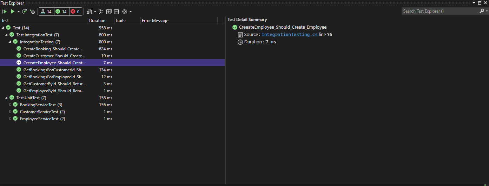

# TestAssignment3
#### Made by: ####

* Christoffer Wegner, cph-ciw109@cphbusiness.dk
* Lukas Bang Stoltz, cph-ls369@cphbusiness.dk

#### In colab with: ### 
* Phillip Thomas Isenborg Andersen, cph-pa124@cphbusiness.dk
* Sumit Dey, cph-sd152@cphbusiness.dk
### NOTE 
It was only possible to handing as 2 persons, therefore the colab note.


### Setup

Run on the .yml file
```bash 
docker-compose up -d
```
Below is location of .yml file

    ├── ...
    ├── Docker-postgres
    │   ├── docker-compose.yml        
    │   ├── ...       
    │   └── ...                
    └── ...

Open the project solution Test Assignment 3.sin in **Visual Studio 2022** as shown below in the directory tree
```
├── Docker-postgres
├── Test Assignment 3
├── Test
├── README.md
├── Test Assignment 3.sln
```
> :warning: Make sure that you use visual studio 2022 and not visual studio code
 
**Run the the program and the database will be automatically be created since migration is added**

**Right click on the test project and press "Run tests"**


### Test results ###

<p align="center">
  
</p>
